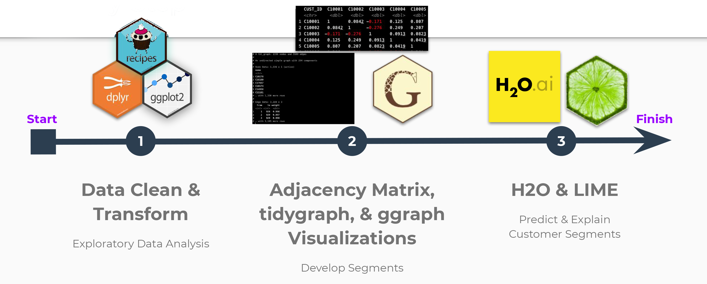
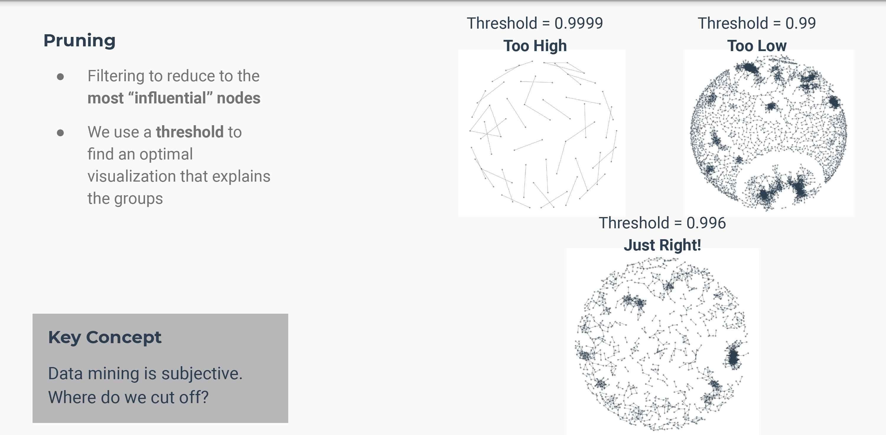
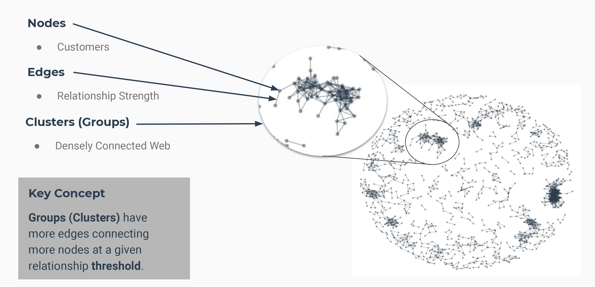

```{r setup, include=FALSE}
knitr::opts_chunk$set(
    eval       = TRUE,
    warning    = FALSE,
    message    = FALSE,
    fig.height = 6,
    fig.width  = 6
    )
```


## Business Understanding

As marketers, we often fall into the trap of trying to please everyone. This is a massive mistake that can end in disaster. What if there was a way to customize products to a specific group of people and have them go viral? 

- Understanding the strength of the relationship and which customers are more important to analyze.
- How to use Network Analysis to identify the most influential customer networks within your customer-base. It's then easy to cater products to them. The result is that products are much more likely to go viral!
- Increase your customer segmentation explainability

## Network Analysis {.tabset .tabset-fade .tabset-pills}


### Community Detection

**Community Detection** is one of the fundamental problems in network analysis, where the goal is to find groups of nodes that are, in some sense, more similar to each other than to the other nodes. 

Communities or clusters are usually groups of vertices having higher probability of being connected to each other than to members of other groups.


### Network Types

There are two types of network Analysis:   

1. **Undirected** Strength of Relationship  
2. **Directed** Hierarchical Structure 

I will be using  **Undirected** (Strength of Relationship) for Clustering.


## Preparations {.tabset .tabset-fade}

### Load libraries
```{r, message=FALSE, warning=FALSE}
library(tidyverse)
library(tidyquant)

# EDA
library(DataExplorer)
library(correlationfunnel)

# Pre-processing
library(recipes)

# Network Analysis
library(tidygraph)
library(ggraph)

library(knitr)
```

### Data
```{r load, message=FALSE, warning=FALSE}
credit_card_tbl <- read_csv("data/CC GENERAL.csv")
```

### Glimpse
```{r, message=FALSE, warning=FALSE,}
credit_card_tbl %>% glimpse()
```


## Customer Segmentation Workflow
```{r, out.width="100%", fig.align="center", echo=FALSE}

```

### Exploratory Data Analysis (EDA)
```{r, message=FALSE, warning=FALSE,fig.width=10}
plot_missing(credit_card_tbl)
```

### Missing Data {.tabset .tabset-fade}

#### Minimum Payments
Minimum Payments has NA (missing data) 
```{r, message=FALSE, warning=FALSE}
# Quantile 
credit_card_tbl %>%
    pull(MINIMUM_PAYMENTS) %>%
    quantile(na.rm = TRUE)
```

##### Correlation Funnel
```{r, message=FALSE, warning=FALSE, fig.width=10}
# Filter all non-missing data
credit_card_no_missing_tbl <- credit_card_tbl %>%
    select_if(is.numeric) %>%
    filter(!is.na(MINIMUM_PAYMENTS)) %>%
    filter(!is.na(CREDIT_LIMIT)) 

credit_card_no_missing_tbl %>%
    binarize() %>%
    correlate(target = MINIMUM_PAYMENTS__825.49646275_Inf) %>% # Largest bin for minimum payment
    plot_correlation_funnel()
```

##### Linear Model (lm)
```{r, message=FALSE, warning=FALSE, fig.width=10}
credit_card_tbl %>%
    ggplot(aes(BALANCE, MINIMUM_PAYMENTS)) + 
    geom_point(alpha = 0.25) +
    geom_smooth(method = "lm")
```

#### Credit Limit
Credit Limit has NA (missing data) 
```{r, message=FALSE, warning=FALSE}
# Quantile
credit_card_tbl %>%
    pull(CREDIT_LIMIT) %>%
    quantile(na.rm = TRUE)
```

##### Correlation Funnel
```{r, message=FALSE, warning=FALSE, fig.width=10}
credit_card_no_missing_tbl %>%
    binarize() %>%
    correlate(target = CREDIT_LIMIT__6500_Inf) %>% # Largest credit limit bin
    plot_correlation_funnel()
```

##### Linear Model (lm)
```{r, message=FALSE, warning=FALSE, fig.width=10}
credit_card_tbl %>%
  ggplot(aes(BALANCE, CREDIT_LIMIT)) + 
  geom_point(alpha = 0.25) +
  geom_smooth(method = "lm")
```

### Pre-processing 

#### Imputation and Standardized
```{r, message=FALSE, warning=FALSE}
rec_obj <- recipe(~ ., data = credit_card_tbl) %>%
    # Random Forest Imputation
    step_bagimpute(MINIMUM_PAYMENTS, CREDIT_LIMIT) %>%
    # Scale & Center for relationship analysis           
    step_center(all_numeric()) %>%
    step_scale(all_numeric()) %>%
    prep()

train_tbl <- bake(rec_obj, new_data = credit_card_tbl)
train_tbl
```

#### Adjacency Matrix
To compare all features to see what customers correlate or related together.
```{r, message=FALSE, warning=FALSE}
customer_correlation_matrix <- train_tbl %>%
    
    # Transpose data for customer similarity
    gather(key = "FEATURE", value = "value", -CUST_ID, factor_key = TRUE) %>%
    spread(key = CUST_ID, value = value) %>%
    select(-FEATURE) %>%
    
    # Adjacency Matrix - Perform Similarity using Correlation
    as.matrix() %>%
    cor()
```


#### Customer Correlation Matrix
This is adjacency  matrix that show how every customers are correlated against the other customers. **Relationshiop Between Each Customers**
```{r, message=FALSE, warning=FALSE}
customer_correlation_matrix %>% as_tibble(rownames = "CUST_ID")
```

#### Pruning The Adjacency Matrix
```{r, message=FALSE, warning=FALSE, out.width="100%", fig.align="center", echo=FALSE}

```

##### Remove customer relationships or related to themselves
```{r, message=FALSE, warning=FALSE}
diag(customer_correlation_matrix) <- 0
customer_correlation_matrix %>% as_tibble(rownames = "CUST_ID")
```

##### Remove duplicate relationships
```{r, message=FALSE, warning=FALSE}
customer_correlation_matrix[upper.tri(customer_correlation_matrix)] <- 0
customer_correlation_matrix %>% as_tibble(rownames = "CUST_ID")
```

##### Prune relationships
Subsets of most influential customers.
```{r, message=FALSE, warning=FALSE}
edge_limit <- 0.99   # Below 0.99 gets zero values
customer_correlation_matrix[customer_correlation_matrix < edge_limit] <- 0
customer_correlation_matrix %>% as_tibble(rownames = "CUST_ID")

sum(customer_correlation_matrix > 0)
```

##### Filter relationships to subset of customers that have relationships
```{r, message=FALSE, warning=FALSE}
customer_correlation_matrix <- customer_correlation_matrix[rowSums(customer_correlation_matrix) > 0, colSums(customer_correlation_matrix) > 0] 
customer_correlation_matrix %>% dim()

customer_correlation_matrix %>% as_tibble(rownames = "CUST_ID")
```

##### Convert to Long Tibble with From & To Column Relating Customers
```{r, message=FALSE, warning=FALSE}
customer_relationship_tbl <- customer_correlation_matrix %>%
    as_tibble(rownames = "from") %>%
    gather(key = "to", value = "weight", -from) %>%
    filter(weight > 0)

customer_relationship_tbl
```

##### Convert to Function for Dynamic Filtering of Edge Limit
```{r, message=FALSE, warning=FALSE}
prep_corr_matrix_for_tbl_graph <- function(correlation_matrix, edge_limit = 0.9999) {
    
    diag(correlation_matrix) <- 0
    
    correlation_matrix[upper.tri(correlation_matrix)] <- 0

    correlation_matrix[correlation_matrix < edge_limit] <- 0
    
    correlation_matrix <- correlation_matrix[rowSums(correlation_matrix) > 0, colSums(correlation_matrix) > 0] 
    
    correlation_matrix %>%
        as_tibble(rownames = "from") %>%
        gather(key = "to", value = "weight", -from) %>%
        filter(weight > 0)

}

prep_corr_matrix_for_tbl_graph(customer_correlation_matrix, edge_limit = 0.99)
```

### Network Visualization
```{r, message=FALSE, warning=FALSE}
customer_correlation_matrix %>%
    
    prep_corr_matrix_for_tbl_graph(edge_limit = 0.997) %>%
    
    as_tbl_graph(directed = FALSE) %>%
    
    ggraph(layout = "kk") +
    geom_edge_link(alpha = 0.5, color = palette_light()["blue"]) +
    geom_node_point(alpha = 0.5, color = palette_light()["blue"]) +
    theme_graph(background = "white")

```

#### Nodes and Edges
```{r, out.width="100%", fig.align="center", echo=FALSE}

```

#### Graph Manipulation
```{r, message=FALSE, warning=FALSE}
customer_tbl_graph <- customer_correlation_matrix %>%
    prep_corr_matrix_for_tbl_graph(edge_limit = 0.997) %>%
    as_tbl_graph(directed = FALSE)

customer_tbl_graph
```

#### Ranking Nodes - Rank by topological traits (Find out which customers are the most important vs the other customers)
```{r, message=FALSE, warning=FALSE}
customer_tbl_graph %>%
    activate(nodes) %>%
    mutate(node_rank = node_rank_traveller()) %>%
    arrange(node_rank)
```

#### Centrality - Number of edges going in/out of node (The node with highest number of edges is the most important)
```{r, message=FALSE, warning=FALSE}
customer_tbl_graph %>%
    activate(nodes) %>%
    mutate(neighbors = centrality_degree()) %>%
    arrange(desc(neighbors))
```

#### Grouping Nodes (Clustering)
```{r, message=FALSE, warning=FALSE}
grouped_tbl_graph <- customer_tbl_graph %>%
    activate(nodes) %>%
    mutate(neighbors = centrality_degree()) %>%
    
    mutate(group = group_components()) %>%
    
    arrange(desc(neighbors)) %>%
    mutate(group_lump = group %>% as_factor() %>% fct_lump(n = 5))

grouped_tbl_graph %>%
    ggraph(layout = "kk") +
    geom_edge_link(alpha = 0.5) +
    geom_node_point(aes(color = group_lump), alpha = 0.5, size = 3) +
    
    theme_graph() +
    scale_color_tq(theme = "light") +
    theme(legend.position = "bottom") +
    labs(title = "Customer Network Detection")
```

### Community Analysis
Join Communities and Inspect Key Features
```{r, message=FALSE, warning=FALSE}
credit_card_group_tbl <- credit_card_tbl %>%
    left_join(as_tibble(grouped_tbl_graph), by = c("CUST_ID" = "name")) %>%
    select(group_lump, CUST_ID, everything()) %>%
    filter(!is.na(group_lump))

credit_card_group_tbl %>% glimpse()
```

```{r, message=FALSE, warning=FALSE}
plot_density_by <- function(data, col, group_focus = 1, ncol = 1) {
    
    col_expr <- enquo(col)
    
    data %>%
        mutate(focus = as.character(group_lump)) %>%
        select(focus, everything()) %>%
        mutate(focus = ifelse(as.character(focus) == as.character(group_focus), 
                                    "1", "Other")) %>%
        mutate(focus = as.factor(focus)) %>%
        
        ggplot(aes(!! col_expr, fill = focus)) +
        geom_density(alpha = 0.4) +
        facet_wrap(~ focus, ncol = ncol) +
        scale_fill_tq() +
        theme_tq()
}

```

#### Group 1. 

##### **By Balance** 
For this first group we can see that every customers has bimodal and trimodal relationships but you can see that for group 1 everyone has pretty high balance compare to the spike vs the other. This categorizes the group 1 as they tend to have a higher balance.
```{r, message=FALSE, warning=FALSE}
credit_card_group_tbl %>% plot_density_by(BALANCE, group_focus = 1)
```

##### **By Min Payment**
```{r, message=FALSE, warning=FALSE}
credit_card_group_tbl %>% plot_density_by(MINIMUM_PAYMENTS, group_focus = 1)
credit_card_group_tbl %>% plot_density_by(log(MINIMUM_PAYMENTS), group_focus = 1)
```

##### **Cash Advance Frequency**
```{r, message=FALSE, warning=FALSE}
credit_card_group_tbl %>% plot_density_by(CASH_ADVANCE_FREQUENCY, group_focus = 1)
```

#### Group 2

##### **By Balance**
```{r, message=FALSE, warning=FALSE}
credit_card_group_tbl %>% plot_density_by(BALANCE, group_focus = 2, ncol = 1)
credit_card_group_tbl %>% plot_density_by(log(BALANCE), group_focus = 2, ncol = 1)
```

##### **By Min Payment**
```{r, message=FALSE, warning=FALSE}
credit_card_group_tbl %>% plot_density_by(MINIMUM_PAYMENTS, group_focus = 2)
credit_card_group_tbl %>% plot_density_by(log(MINIMUM_PAYMENTS), group_focus = 2)
```

##### **Cash Advance Frequency**
```{r, message=FALSE, warning=FALSE}
credit_card_group_tbl %>% plot_density_by(CASH_ADVANCE_FREQUENCY, group_focus = 2)
```

### H2O and LIME 
Predict and Explain Customer Segments.

**H2O** 
-Multi-class prediction with H2O AutoML 
-Training a model to detect which group each customer belongs to which group.
**LIME Explanation**
-ML Explanation of which features contribute to each class with LIME
-Returns a function called explain_customer()

```{r, message=FALSE, warning=FALSE}
source("h2o_lime.R")
```

```{r, message=FALSE, warning=FALSE}
credit_card_group_tbl

h2o.predict(h2o_model, newdata = as.h2o(credit_card_group_tbl)) %>%
  as_tibble()

```

#### **Explain why customers 6 belong to communities**.
```{r}
explain_customer(6)
```

