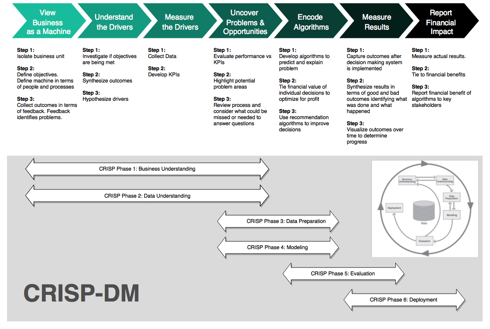

```{r setup, include=FALSE}
knitr::opts_chunk$set(
    eval       = TRUE,
    warning    = FALSE,
    message    = FALSE,
    fig.height = 6,
    fig.width  = 12
    )
```

# Overview

This is a detailed code-through designed to familiarize the Business with:

- Market Basket Analysis
- Recommend products based on customer’s cart.
- Customer Behavior 
  - Do customers purchase items together frequently?
  - Understand what customers buy.
- Recommendations based on their similarity to what customers normally buy.

# Market Basket Analysis Strategies {.tabset .tabset-pills}

[Market Basket Analysis (also called Affinity Analysis)](https://en.wikipedia.org/wiki/Affinity_analysis) is the process of discovering relationships between individuals and the products that they purchase. It's an excellent way to better understand customer buying habits (think likelihood of a clothing purchase based on similarity to other customers in retail) and to create product recommendations (think Netflix ratings-based movie recommendations). There are several common methods to perform Market Basket Analysis each with strengths and weaknesses including:

- Collaborative Filtering
- Association Rules
- Item Popularity
- Content-Based Filtering
- Hybrid Models

__Click the tabs below__ to learn more about each method. 

## Collaborative Filtering

__Collaborative Filtering__ is uses mathematical similarities to determine the likelihood of product purchases. Two strategies are employed: __(1) user-based (e.g. customers) or (2) item-based (e.g. products)__. Both methodologies start with a __ratings matrix__, which is simply the users (rows) by the items (columns). Similarity is typically performed using Cosine similarity or Jaccard similarity. 

__User-based collaborative filtering (UBCF)__ investigates similarities between the users market basket to find other users with similar baskets, then developing probabilities of items based on the highest probability products. Note that this method disregards the item-based similarities. 

__Item-based collaboartive filtering (IBCF)__ investigates similarities between items that are frequently purchased together. Note that this method disregards the user-based similarities. 

## Association Rules

__Association Rules__: Association Rules are widely used to analyze retail basket or transaction data, and are intended to identify strong rules discovered in transaction data using measures of interestingness, based on the concept of strong rules. [^1] Rules between two items purchased are developed using three metrics: "Support", "Confidence", and "Lift":

- __Support__ is the probability of two items co-occurring. P(Item1 & Item2)
- __Confidence__ is the Support divided by the probability of purchasing the second item. Support / P(Item2)
- __Lift__ is the Confidence divided by the probability of purchasing the first item. Confidence / P(Item1)

When combined, the items most likely to be purchased is that with the highest association _Lift_. The method is fast and works well by analyzing items most frequently purchased together. One downside is it doesn't consider the user's purchase history.


## Popular Items

__Popular Items__: This strategy is simple yet effective. Just sort the items based on purchase frequency (i.e. popularity) to understand global purchasing habits. Recommendations are just the most frequently purchased items that the are not currently being purchased. The downside is this approach may be too simple missing some of the underlying similarities within segments or cohorts of customers. However, the Business Scientist may be able to further categorize popularity (e.g. if customer is in power tools aisle, list most popular power tools).

## Content-Based Filtering

__Content-Based Filtering__ evaluates the _past history_ of a purchaser to develop probability of future purchases. This method can be useful in discovering key user preferences such as what he/she tends to purchase at which time of day or day of week. The method requires detailed knowledge of past history. If this is unavailable, a similar user profile (e.g. based on demographic information) can be used in place of detailed history. 

## Hybrid Models

__Hybrid Models__ are often an "ensemble" of multiple approaches that leverage the strengths of various modeling approaches. A typical ensemble may include both user-based and item-based collaborative filtering to mine both user and item based similarities along with content-based filtering that leverages the history of the customer's purchases. The resulting model is often better than any one of the models. 


# Analysis

In this analysis, I developed several models using `Collaborative Filtering`, `Association Rules`, and `Popularity modeling` strategies, which are easily generated and compared using the `recommenderlab` package. 


## Libraries

Load the following libraries.

```{r}

library(tidyverse)
library(vroom)
library(fs)
library(knitr)
library(glue)
library(cowplot)
library(tidyverse)
library(tidyquant)

# Interactive visualization
library(plotly)
# Visualizing association rules and frequent item sets 
library(arulesViz)

# Recommender algorithms
library(recommenderlab)

# Evaluate association rules 
library(arules)

```


## Data {.tabset .tabset-fade .tabset-pills}

The [Instacart dataset](https://www.instacart.com/datasets/grocery-shopping-2017) is open sourced as discussed in this [article by Instacart](https://tech.instacart.com/3-million-instacart-orders-open-sourced-d40d29ead6f2). In addition, a [Kaggle Competition](https://www.kaggle.com/c/instacart-market-basket-analysis) was run in 2016-2017, which further promoted use of the Instacart dataset among the Data Science Community.  

The Instacart Dataset contains a number of interesting features that can be further analyzed including departments, aisles, reordering habits, and so on. In this analysis will focus on __Market Basket__, which is the contents of individual orders (i.e. `order_id` and `product_name`). 

```{r, eval=FALSE, echo=FALSE}
# The sourced file includes the read_director_to_list() function
source("scripts/read_directory.R")
instacart_raw_list <- read_directory_to_list("data")
```

Here are the element names for the data (tibbles) stored in `instacart_raw_list`.

```{r, eval=FALSE, echo=FALSE}
instacart_raw_list %>% names()
```

### Orders

```{r}
orders <- vroom("data/orders.csv", delim = ",")
orders
```

### Orders product

```{r}
order_products_train <- vroom("data/order_products__train.csv", delim = ",")
order_products_train
```

### Products

```{r}
products <- vroom("data/products.csv", delim = ",")
products
```

### Aisles

```{r}
aisles <- vroom("data/aisles.csv", delim = ",")
aisles
```

### Departments

```{r}
departments <- vroom("data/departments.csv", delim = ",")
departments
```


Combining market basket from `"order_products__prior"` and the `"products"` data. We can see that it's __32.4M rows__, which is a lot of data to deal with. Creating a recommender with this size data set would be a lot to handle.  

```{r, eval=FALSE, echo=FALSE}
market_basket_tbl <- instacart_raw_list$order_products__prior %>%
    inner_join(instacart_raw_list$products, by = "product_id")

market_basket_tbl %>%
    select(order_id, product_name)
```

## CRISP-DM / BSPF Data Science Process

We'll follow the combined BSPF / CRISP-DM data science framework. For brevity, we won't go into a full BSPF analysis (this is not practical for a code through). 

```{r, out.width="100%", fig.align="center", echo=FALSE}

```


### 1. Business Understanding

The business problem is that we can potentially derive more sales from our customers by recommending products they are likely to want. Often the customer goes to the store or visits the website for a specific reason, but for the organization this is a prime opportunity to increase sales by recommending products the customer may not be thinking about. These could be:  

1. Products similar people purchased (think Bill and Jeff both enjoy World of Warcraft so they might like the same computer gaming setup)

2. Products that were purchased with similar items (think portable chargers for an Amazon Alexa)

3. Products that were purchased in the recent past (think baby diapers, which, as a new father, I (Matt) am finding that babies go through FAST)


### 2. Data Understanding

One of the easiest ways to understand a _market basket_ is by looking at how frequently items are purchased. We can use the `count()` function along with some calculations to understand which items are popular: 

- Percentage of total `"pct"`
- Cumulative percentage of total `"cumulative_pct`
- Popular product which we define somewhat arbitrarily as less than or equal to `50%` cumulative percent 

```{r}
orders_combined_tbl <- order_products_train %>%
    left_join(orders) %>%
    left_join(products) %>%
    left_join(aisles) %>%
    left_join(departments) %>%
    select(eval_set, user_id,
           contains("order"), contains("product"),
           contains("aisle"), contains("department"), everything())

item_frequency_tbl <- orders_combined_tbl %>%
    count(product_name, product_id, aisle, department) %>%
    arrange(desc(n)) %>%
    mutate(
        pct = n / sum(n),
        cumulative_pct = cumsum(pct),
        popular_product = ifelse(cumulative_pct <= 0.5, "Yes", "No")
    ) %>%
    rowid_to_column(var = "rank") %>%
    mutate(label_text = str_glue("Rank: {rank}
                                 Product: {product_name}
                                 ProductID: {product_id}
                                 Aisle: {aisle}
                                 Department: {department}
                                 Count: {n}
                                 Pct: {scales::percent(pct)}
                                 Cumulative Pct: {scales::percent(cumulative_pct)}"))


item_frequency_tbl %>% select(product_name,n,pct,cumulative_pct, popular_product)
```

#### Which products are purchased most frequently? {.tabset .tabset-pills}

We can see a few things from this table:

1. The top item (1.35% of purchases) is Bananas
2. There are almost 40K items, which is a lot to handle via a ratings matrix.

Let's visualize to see what we are dealing with. We'll use `ggplot2` to help some of the interesting aspects of the market basket stand out. 

- We'll set the `size = n`, which increases the size of the point based on how frequently it is purchased. 
- We'll set the `color = popular_product`, which separates items in the top 50% of purchase frequency from items in the bottom 50%.

```{r, fig.width=10, fig.height=7}
item_frequency_tbl %>%
    rowid_to_column() %>%
    ggplot(aes(rank, n)) +
    geom_point(aes(size = n, color = popular_product), alpha = 0.2) +
    theme_tq() +
    scale_color_tq() +
    theme(legend.direction = "vertical", 
          legend.position  = "right") +
    labs(title = "Item Frequency", 
         subtitle = "Top Items Account For Majority Of Purchases")

```

From the visualization, we immediately see that the data is highly skewed. The top 50% of purchases, `sum(n)`, are derived from __only 852__ of the almost 40,000 items. This is less than 2.2% of the total products (items).

```{r, echo=FALSE, eval=FALSE}
##### Interactive Plot
g <- item_frequency_tbl %>%
    ggplot(aes(rank, n)) +
    geom_point(aes(size = n, color = popular_product, text = label_text), alpha = 0.2) +
    theme_tq() +
    scale_color_tq() +
    theme(legend.direction = "vertical", 
          legend.position  = "right") +
    labs(title = "Item Frequency", 
         subtitle = "Top Items Account For Majority Of Purchases")

ggplotly(g, tooltip = "text")
```


```{r}
item_frequency_tbl %>%
    count(popular_product) %>%
    mutate(pct = n / sum(n))
```

#### Do Customers Purchase More Frequently {.tabset .tabset-pills}

```{r}
user_frequency_tbl <- orders_combined_tbl %>%
    distinct(user_id, order_id) %>%
    count(user_id) %>%
    arrange(desc(n)) %>%
    mutate(
        pct = n / sum(n),
        cumulative_pct = cumsum(pct),
        popular_customer = ifelse(cumulative_pct <= 0.5, "Yes", "No")
    ) %>%
    rowid_to_column(var = "rank") 


user_frequency_tbl
```

#### Do Certain Customers Buy More Products? {.tabset .tabset-pills}

##### Table 

**n**: Counting how many products are in their basket.

Looks like the first customer has `80 products`.
```{r}
user_item_frequency_tbl <- orders_combined_tbl %>%
    count(user_id) %>%
    arrange(desc(n)) %>%
    mutate(
        pct = n / sum(n),
        cumulative_pct = cumsum(pct),
        popular_customer = ifelse(cumulative_pct <= 0.5, "Yes", "No")
    ) %>%
    rowid_to_column(var = "rank") 


user_item_frequency_tbl
```

##### Plot
```{r}
user_item_frequency_tbl %>%
    ggplot(aes(rank, n)) +
    geom_point(aes(size = n, color = popular_customer), alpha = 0.2) +
    theme_tq() +
    scale_color_tq() +
    theme(legend.direction = "vertical",
          legend.position  = "right") +
    labs(title = "User Frequency",
         subtitle = "Yes - Some Customers have larger baskets")

```

```{r, eval=FALSE, echo=FALSE}
# Interactive Plot
# g <- user_item_frequency_tbl %>%
#     ggplot(aes(rank, n)) +
#     geom_point(aes(size = n, color = popular_customer), alpha = 0.2) +
#     theme_tq() +
#     scale_color_tq() +
#     theme(legend.direction = "vertical", 
#           legend.position  = "right") +
#     labs(title = "User Frequency", 
#          subtitle = "Yes - Some Customers have larger baskets")
# 
# ggplotly
```


### 3. Data Preparation {.tabset .tabset-pills}

We'll need to create a __ratings matrix__, which has the purchase history formatted in a 2x2 matrix with rows being orders and columns being products. This format is often called a __user-item matrix__ because users (e.g. customers or orders) tend to be on the rows and items (e.g. products) in the columns. 

The ratings matrix can be extraordinarily sparse given we have 32M+ data points with 40K products. Further, many of these data points are not _meaningful_. We saw that the data is highly skewed, which indicates that the lowest frequency items can likely be discarded because these are by definition "unpopular". We can plan our data preparation by:

- Taking advantage of item popularity. A small proportion of the products are driving a large proportion of the purchase frequencies. By limiting to the top items, we can reduce the width of the ratings matrix making it much easier to handle without losing much.

- Further reduce the height of the matrix through sampling. We can sample 20,000 orders to make the ratings matrix more manageable. Further, we can limit the market baskets to those with at least 3 popular items, which ensures similarities between multiple items. 

First, let's filter to only the products that are popular, meaning the top products that drive 50% of the purchases. 


#### Popular Products

```{r}

# Get names of top products
top_products_vec <- item_frequency_tbl %>%
    filter(popular_product == "Yes") %>%
    pull(product_name)

# Use names to filter 
top_products_basket_tbl <- orders_combined_tbl %>%
    filter(product_name %in% top_products_vec) 


top_products_basket_tbl %>%  select(order_id, product_name)
```

#### Large baskets

Users have the largest baskets
```{r}
# Condense user-item / Transaction-Item Matrix for Evaluation
top_users_vec <- user_item_frequency_tbl %>%
    # Filter the rank less than 2500
    filter(rank < 2500) %>%  
    pull(user_id)

market_basket_condensed_tbl <- top_products_basket_tbl %>%
    filter(user_id %in% top_users_vec) 

market_basket_condensed_tbl 
```


Next, let's sample 20,000 orders and then filter to those with baskets of at least 3 popular items. Note that it could take a while to filter first due to the aggregation step. The downside is that we end up with less than 20,000 total samples. If desired, we could increase the sample size further. 

```{r}
n_sample  <- 20000
min_items <- 3

set.seed(100)
sample_order_ids <- sample(unique(top_products_basket_tbl$order_id), size = n_sample)

top_products_sample_tbl <- top_products_basket_tbl %>%  
    select(order_id, product_name) %>% 
    # Sample orders
    filter(order_id %in% sample_order_ids) %>%
    # Filter using min_items
    group_by(order_id) %>%
    filter(n() >= min_items) %>%
    ungroup()

top_products_sample_tbl 
```


### 4. Market Basket Analysis {.tabset .tabset-pills}

convert the sampled market baskets to a ratings matrix in the format that `recommenderlab` uses. The type of ratings matrix is a __"binary rating matrix"__, which consists of 0's and 1's indicating whether or not a product was purchased. 

#### Data format(Binary Ratings Matrix)
```{r}
user_item_tbl <- market_basket_condensed_tbl %>%
    select(user_id, product_name) %>%
    mutate(value = 1) %>%
    spread(product_name, value, fill = 0)

user_item_rlab <- user_item_tbl %>%
    select(-user_id) %>%
    as.matrix() %>%
    # Convert to binaryRatingsMatrix class used by recommenderlab
    as("binaryRatingMatrix")

user_item_rlab
```

```{r}
# Relationship with association rules
user_item_rlab@data %>% summary()
```

##### **User-Items frequency**
```{r}
# Items frequency
itemFrequencyPlot(user_item_rlab@data, topN=30, type="absolute",
                  xlab = "Items", ylab = "Frequency",
                  col = "steelblue",
                  main = "Frequency Plot")
```


As a side note, a second type of ratings matrix, a __"real rating matrix"__ consisting of actual user ratings (e.g. Netflix movie ratings on a 1 to 5 scale), is permitted. This format must be normalized, which can be done using the `normalize()` function. Because we are working with binary data, no normalization is necessary.  

#### Association rules {.tabset .tabset-fade .tabset-pills}

Used to Identify Rules 
1. Support
 	- Probability of co-occurrence
	- P(Item 1 & Item 2)
2. Confidence Support / P(Item 2)
3. Lift Confidence / P(Item 1)

```{r}
# Association Rules
model_ar <- recommenderlab::Recommender(
    data = user_item_rlab, 
    method = "AR", 
    param = list(supp = 0.01, conf = 0.10))

# Extract rule base
rules <- model_ar@model$rule_base
```


##### Rule base graph

```{r}
sort(rules, by = "lift", decreasing = TRUE)[1:20] %>% inspect() 
```

```{r}
plot(rules, method = "graph")
```

```{r}
plot(model_ar@model$rule_base, method = "graph", 
     control=list(layout=igraph::in_circle()))
```


##### Product recommender

Scatterplot for Product recommender with lift confidence.

```{r, fig.height = 6,fig.width  = 8}
plotly_arules(rules, method = "scatterplot", 
              marker = list(opacity = .7, size = ~lift), 
              colors = c("blue", "green"))
```

#### User-based collaborative filtering

User-based collaborative filtering examines `user similarity`

```{r}
model_ucbf <- recommenderlab::Recommender(
    data = user_item_rlab, 
    method = "UBCF", 
    param  = list(method = "Cosine", nn = 500))
```


